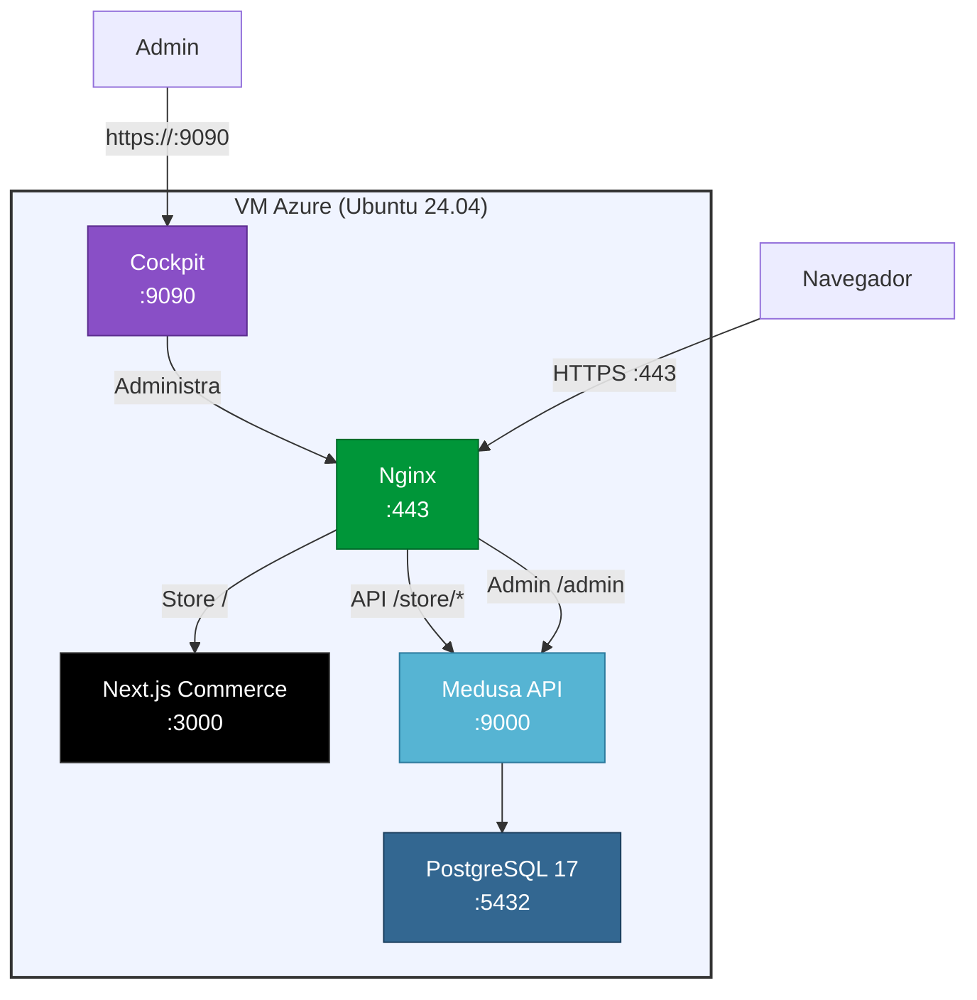

# Ecommerce — Podman + Cockpit en Azure

Despliegue de un e-commerce con **Next.js Commerce** (frontend), **Medusa** (backend API) y **PostgreSQL**, orquestados con **Podman Compose** y gestionados desde **Cockpit** en una VM de Azure provisionada con **Terraform**.

> **Stack:** Next.js 13 + Medusa + PostgreSQL 17 + Nginx + Podman + Cockpit + Terraform + Azure VM

---

## Arquitectura



---

## Estructura del proyecto

```
podman-cockpit-deployment/
├── terraform/                    # Provisionamiento Azure
│   ├── main.tf                   # RG, VNet, NSG, VM
│   ├── variables.tf              # Inputs configurables
│   ├── outputs.tf                # IP publica, URLs
│   ├── providers.tf              # azurerm ~> 4.0
│   └── scripts/
│       └── setup.sh              # Cloud-init: Podman, Cockpit, compose
│
├── frontend/                     # Next.js Commerce (Medusa)
│   ├── app/                      # App Router
│   ├── components/               # UI components
│   ├── lib/                      # Medusa API client
│   ├── next.config.js            # standalone output
│   ├── package.json
│   └── Dockerfile                # Multi-stage build
│
├── nginx/
│   ├── Dockerfile
│   ├── nginx.conf
│   ├── conf.d/
│   │   └── default.conf          # HTTPS + proxy a Next.js + Medusa
│   └── generate-certs.sh
│
├── compose.yml                   # Orquestacion Podman/Docker
├── .env.example                  # Template de variables
└── README.md
```

---

## Tecnologias

| Tecnologia | Rol | Version |
|:-----------|:----|:--------|
| **Next.js Commerce** | Frontend storefront | 13.x |
| **Medusa** | Backend API / CMS | latest |
| **PostgreSQL** | Base de datos | 17 |
| **Nginx** | Reverse proxy SSL | 1.27 |
| **Podman** | Motor de contenedores | latest |
| **Cockpit** | Administracion web de la VM | latest |
| **Terraform** | Infraestructura como codigo | >= 1.5 |
| **Azure** | Cloud provider (VM Ubuntu 24.04) | - |

---

## Prerrequisitos

- [Azure CLI](https://learn.microsoft.com/cli/azure/install-azure-cli) instalado y configurado (`az login`)
- [Terraform](https://developer.hashicorp.com/terraform/install) >= 1.5 instalado
- [Podman](https://podman.io/getting-started/installation) o Docker local (para build)
- [Node.js](https://nodejs.org/) >= 18
- Una clave SSH publica (`~/.ssh/id_rsa.pub` o similar)
- Git

---

## Despliegue rapido

### 1. Provisionar la VM con Terraform

```bash
cd terraform

cp terraform.tfvars.example terraform.tfvars
# Editar: db_password, ssh_public_key_path, repo_url

terraform init
terraform plan
terraform apply
```

### 2. Build del frontend (local)

```bash
cd frontend

# Instalar dependencias
pnpm install

# Configurar .env
cp .env.example .env
# Editar: NEXT_PUBLIC_MEDUSA_BACKEND_API=https://<IP_PUBLICA>

# Build
pnpm build
```

### 3. Levantar el stack en la VM

```bash
# SSH a la VM
ssh -i terraform/output.tfstate azureuser@<IP_PUBLICA>

cd /opt/podman-cockpit-deployment

# Si no existe .env, crear desde el ejemplo
cp .env.example .env
# Editar con los valores reales

# Generar certificados SSL
bash nginx/generate-certs.sh <IP_PUBLICA>

# Levantar contenedores
podman compose up -d --build
```

---

## URLs de acceso

| Servicio | URL |
|:---------|:----|
| **Tienda** | `https://<IP_PUBLICA>` |
| **Medusa Admin** | `https://<IP_PUBLICA>/admin` |
| **Medusa API** | `https://<IP_PUBLICA>/store/*` |
| **Cockpit** | `https://<IP_PUBLICA>:9090` |

---

## Variables de entorno

Copiar `.env.example` a `.env` y configurar:

| Variable | Descripcion | Ejemplo |
|:---------|:------------|:--------|
| `POSTGRES_PASSWORD` | Password de PostgreSQL | `mypass123` |
| `JWT_SECRET` | Secreto JWT de Medusa | `openssl rand -hex 32` |
| `COOKIE_SECRET` | Secreto para cookies | `openssl rand -hex 32` |
| `MEDUSA_REVALIDATION_SECRET` | Secret for revalidation | `openssl rand -hex 16` |
| `SITE_NAME` | Nombre de la tienda | `Mi Tienda` |

---

## Desarrollo local

### Medusa Backend

```bash
# Levantar PostgreSQL
podman run -d --name pg-dev \
  -e POSTGRES_DB=medusa \
  -e POSTGRES_USER=medusa \
  -e POSTGRES_PASSWORD=medusa \
  -p 5432:5432 \
  postgres:17-alpine

# Medusa (requiere install separado)
# Ver: https://docs.medusajs.com/development/backend/install
```

### Next.js Commerce

```bash
cd frontend

cp .env.example .env
# Editar: NEXT_PUBLIC_MEDUSA_BACKEND_API=http://localhost:9000

pnpm install
pnpm dev
# Next.js: http://localhost:3000
```

---

## Solucion de problemas

### Los contenedores no inician

```bash
podman compose logs nginx
podman compose logs nextjs
podman compose logs medusa
podman compose logs postgres
```

### Cockpit no carga

```bash
sudo systemctl status cockpit.socket
sudo systemctl start cockpit.socket
```

### Errores SSL en el navegador

El certificado es self-signed. Aceptar la excepcion de seguridad en el navegador.

---

## Referencias

- [Next.js Commerce](https://github.com/vercel/commerce)
- [Medusa Commerce](https://github.com/medusajs/vercel-commerce)
- [Medusa Documentation](https://docs.medusajs.com/)
- [Podman Compose](https://github.com/containers/podman-compose)
- [Cockpit Project](https://cockpit-project.org/)
- [Terraform Azure Provider](https://registry.terraform.io/providers/hashicorp/azurerm/latest/docs)
