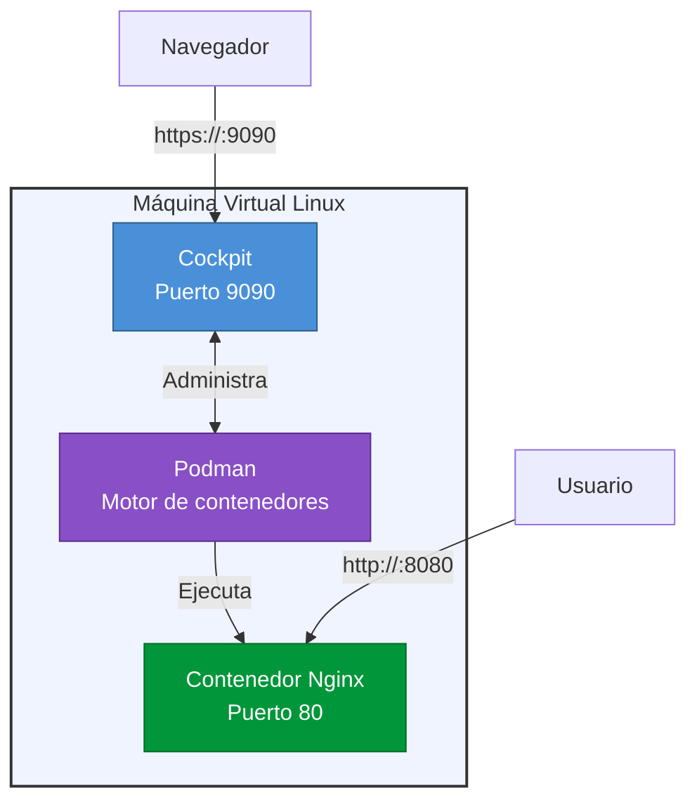

# Contenerización con Podman y Cockpit

Repositorio dedicado al despliegue y administración de aplicaciones web mediante contenedores **Podman**, gestionados a través de la interfaz web **Cockpit**.

> **Objetivo final:** levantar un servidor Nginx dentro de un contenedor Podman, administrado desde Cockpit, y verificar su funcionamiento modificando el contenido HTML.

---

## Tabla de contenidos

- [Escenario](#escenario)
- [Tecnologías](#tecnologías)
- [Prerrequisitos](#prerrequisitos)
- [Actividades paso a paso](#actividades-paso-a-paso)
  - [1. Crear la máquina virtual](#1-crear-la-máquina-virtual)
  - [2. Instalar Podman](#2-instalar-podman)
  - [3. Instalar Cockpit](#3-instalar-cockpit)
  - [4. Instalar el complemento de Podman para Cockpit](#4-instalar-el-complemento-de-podman-para-cockpit)
  - [5. Acceder a Cockpit](#5-acceder-a-cockpit)
  - [6. Descargar la imagen de Nginx](#6-descargar-la-imagen-de-nginx)
  - [7. Crear y ejecutar el contenedor](#7-crear-y-ejecutar-el-contenedor)
  - [8. Personalizar la página web](#8-personalizar-la-página-web)
  - [9. Documentar el proceso](#9-documentar-el-proceso)
- [Resultado esperado](#resultado-esperado)
- [Solución de problemas](#solución-de-problemas)
- [Referencias](#referencias)

---

## Escenario

Se requiere preparar una infraestructura Linux para alojar servicios contenerizados. Para ello se utilizará una máquina virtual sobre la cual se instalará **Podman** como motor de contenedores y **Cockpit** como herramienta de administración web.

Como demostración del funcionamiento del entorno, se desplegará un contenedor basado en la imagen oficial de **Nginx**, modificando posteriormente su contenido HTML.



---

## Tecnologías

| Tecnología | Rol | Descripción |
|:-----------|:----|:------------|
| **Podman** | Motor de contenedores | Alternativa daemon-less a Docker, sin necesidad de permisos root |
| **Cockpit** | Administración web | Interfaz gráfica para gestionar servidores Linux desde el navegador |
| **Nginx** | Servidor web | Servidor de contenido de alta performance, usado como ejemplo de despliegue |
| **Linux** | Sistema operativo | Distribución basada en Debian/Ubuntu para la máquina virtual |

---

## Prerrequisitos

- Conocimientos básicos de línea de comandos Linux
- Un hipervisor de máquinas virtuales instalado (VirtualBox, VMware o similar)
- Acceso a internet para descargar paquetes e imágenes

---

## Actividades paso a paso

### 1. Crear la máquina virtual

Crear una máquina virtual con una distribución Linux (recomendada: **Ubuntu 22.04 LTS** o superior).

**Especificaciones mínimas recomendadas:**

| Recurso   | Mínimo        | Recomendado   |
|:----------|:--------------|:--------------|
| CPU       | 1 núcleo      | 2 núcleos     |
| RAM       | 1 GB          | 2 GB          |
| Disco     | 10 GB         | 20 GB         |
| Red       | NAT/Bridged   | Bridged       |

**Hipervisores compatibles:**

- **VirtualBox** — gratuito, multiplataforma
- **VMware Workstation Player** — gratuito para uso personal
- **Microsoft Azure** — VM en la nube (requiere cuenta de Azure)
- **Proxmox** — para entornos de laboratorio con múltiples VMs

---

### 2. Instalar Podman

Acceder a la máquina virtual y ejecutar los siguientes comandos:

```bash
# Actualizar repositorios
sudo apt update

# Instalar Podman
sudo apt install podman -y
```

Verificar la instalación:

```bash
podman --version
```

Ejemplo de salida esperada:

```
podman version 4.3.1
```

---

### 3. Instalar Cockpit

```bash
# Instalar Cockpit
sudo apt install cockpit -y

# Habilitar e iniciar el servicio
sudo systemctl enable --now cockpit.socket
```

Verificar que el servicio esté activo:

```bash
sudo systemctl status cockpit.socket
```

---

### 4. Instalar el complemento de Podman para Cockpit

Este complemento integra la gestión de contenedores Podman directamente en la interfaz de Cockpit.

```bash
sudo apt install cockpit-podman -y
```

> **Nota:** En distribuciones basadas en RHEL/Fedora, el paquete se llama `cockpit-podman` pero puede requerir repositorios adicionales.

---

### 5. Acceder a Cockpit

Abrir un navegador y acceder a la interfaz web de Cockpit:

| Entorno          | URL de acceso                        |
|:-----------------|:-------------------------------------|
| Desde la VM      | `https://localhost:9090`             |
| Desde otra máquina | `https://IP_DEL_SERVIDOR:9090`       |

> **IMPORTANTE:** Cockpit usa HTTPS con certificado auto-firmado. El navegador mostrará una advertencia de seguridad. Aceptar el certificado para continuar.

Iniciar sesión con las credenciales de un usuario del sistema:

```bash
# Si no recuerdas tu usuario, puedes usar:
whoami
```

---

### 6. Descargar la imagen de Nginx

Desde la interfaz de Cockpit:

1. Navegar a la sección **Podman** (ícono de contenedores en el menú lateral)
2. Ir a la pestaña **Images** (Imágenes)
3. Hacer clic en **Download** (Descargar)
4. Buscar `nginx` y seleccionar la imagen oficial (`docker.io/library/nginx`)
5. Hacer clic en **Download** para iniciar la descarga

También se puede hacer desde la línea de comandos:

```bash
podman pull docker.io/library/nginx:latest
```

---

### 7. Crear y ejecutar el contenedor

**Desde Cockpit:**

1. Ir a la pestaña **Containers** (Contenedores)
2. Hacer clic en **Create container** (Crear contenedor)
3. Seleccionar la imagen `nginx` descargada previamente
4. Asignar un nombre al contenedor (ej: `mi-sitio-web`)
5. Configurar el mapeo de puertos:
   - Puerto del contenedor: `80`
   - Puerto del host: `8080` (o el que prefieras)
6. Hacer clic en **Create and run** (Crear y ejecutar)

**Desde la línea de comandos:**

```bash
podman run -d \
  --name mi-sitio-web \
  -p 8080:80 \
  docker.io/library/nginx:latest
```

Verificar que el contenedor esté en ejecución:

```bash
podman ps
```

Ejemplo de salida:

```
CONTAINER ID  IMAGE                           COMMAND               CREATED        STATUS        PORTS                 NAMES
a1b2c3d4e5f6  docker.io/library/nginx:latest  /docker-entrypoint…  5 seconds ago  Up 5 seconds  0.0.0.0:8080->80/tcp  mi-sitio-web
```

---

### 8. Personalizar la página web

Acceder al contenedor y modificar el archivo HTML de Nginx:

**Desde la línea de comandos:**

```bash
# Acceder al contenedor
podman exec -it mi-sitio-web bash

# Dentro del contenedor, editar el archivo HTML
echo '<!DOCTYPE html>
<html>
<head><title>Mi Sitio</title></head>
<body>
  <h1>Hola desde Podman + Cockpit</h1>
  <p>Este sitio corre en un contenedor Nginx.</p>
</body>
</html>' > /usr/share/nginx/html/index.html

# Salir del contenedor
exit
```

Verificar accediendo desde el navegador:

```
http://localhost:8080
```

o desde otra máquina en la red:

```
http://IP_DEL_SERVIDOR:8080
```

---

### 9. Documentar el proceso

Registrar los siguientes elementos como parte de la entrega:

| Elemento              | Descripción                                      |
|:----------------------|:-------------------------------------------------|
| Procedimiento         | Pasos realizados con comandos exactos             |
| Capturas de pantalla  | Interfaz de Cockpit, contenedor ejecutándose      |
| Problemas encontrados | Errores, comportamientos inesperados              |
| Soluciones implementadas | Cómo se resolvió cada problema                 |
| Resultado final       | Evidencia del sitio web funcionando               |

---

## Resultado esperado

Al completar todas las actividades:

- [x] Máquina virtual Linux funcionando
- [x] Podman instalado y operativo
- [x] Cockpit accesible desde el navegador
- [x] Contenedor Nginx ejecutándose y sirviendo contenido personalizado
- [x] Sitio web accesible desde el navegador

---

## Solución de problemas

### Cockpit no carga en el navegador

```bash
# Verificar que el servicio esté activo
sudo systemctl status cockpit.socket

# Si no está activo, iniciarlo
sudo systemctl start cockpit.socket
```

### El contenedor no inicia

```bash
# Verificar logs del contenedor
podman logs mi-sitio-web

# Verificar que el puerto no esté en uso
sudo ss -tlnp | grep :8080
```

### No se puede acceder desde otra máquina

- Verificar que el firewall permita el tráfico en el puerto 9090 (Cockpit) y 8080 (Nginx)
- En Ubuntu: `sudo ufw allow 9090/tcp && sudo ufw allow 8080/tcp`
- Si se usa una VM, verificar la configuración de red (Bridged o NAT con port forwarding)

### Permiso denegado al ejecutar comandos Podman

```bash
# Podman rootless: asegurarse de que el usuario esté en el grupo
sudo usermod -aG podman $USER

# Cerrar sesión y volver a entrar para que el cambio surta efecto
```

---

## Referencias

- [Documentación oficial de Podman](https://podman.io/getting-started/installation)
- [Documentación oficial de Cockpit](https://cockpit-project.org/)
- [Docker Hub — Nginx](https://hub.docker.com/_/nginx)
- [Podman vs Docker](https://podman.io/blogs/2019/02/13/podman-vs-docker.html)
