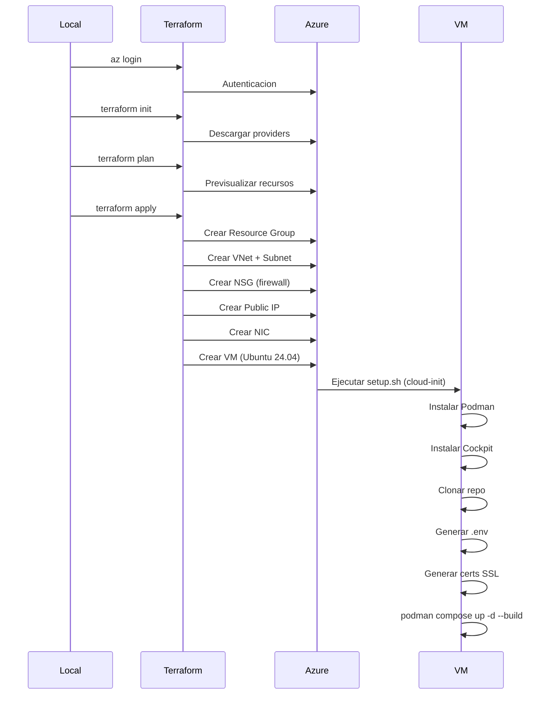

# Azure

## Que es

[Azure](https://azure.microsoft.com/) es la plataforma cloud de Microsoft. En este proyecto se usa para provisionar y alojar la **VM Linux** donde corre todo el stack de e-commerce (Podman, Nginx, Next.js, Medusa, PostgreSQL).

---

## Recursos creados por Terraform

| Recurso | Nombre | Descripcion |
|:--------|:-------|:------------|
| Resource Group | `rg-podman-ecommerce` | Contenedor logico para todos los recursos |
| Virtual Network | `vnet-vm-podman-ecommerce` | Red virtual (10.0.0.0/16) |
| Subnet | `subnet-main` | Subred (10.0.1.0/24) |
| Public IP | `pip-vm-podman-ecommerce` | IP publica estatica |
| NSG | `nsg-vm-podman-ecommerce` | Reglas de firewall |
| NIC | `nic-vm-podman-ecommerce` | Interfaz de red |
| VM | `vm-podman-ecommerce` | Ubuntu 24.04 LTS |

---

## VM — Especificaciones

| Parametro | Valor |
|:----------|:------|
| Imagen | Ubuntu 24.04 LTS |
| Tamano | `Standard_B2s` (2 vCPUs, 4GB RAM) |
| Disco | StandardSSD_LRS |
| Usuario | `azureuser` (configurable) |
| SSH | RSA 4096 bits (generado por Terraform) |
| Region | East US (default) |

---

## NSG — Reglas de firewall

| Regla | Puerto | Protocolo | Prioridad | Descripcion |
|:------|:-------|:----------|:----------|:------------|
| `allow-ssh` | 22 | TCP | 100 | Acceso SSH a la VM |
| `allow-http` | 80 | TCP | 200 | Redirect HTTP → HTTPS |
| `allow-https` | 443 | TCP | 300 | Acceso al sitio web |
| `allow-cockpit` | 9090 | TCP | 400 | Acceso a Cockpit |

---

## Cloud-init (setup.sh)

Cuando Terraform crea la VM, ejecuta `terraform/scripts/setup.sh` como `custom_data`. Este script:

1. **Actualiza el sistema** — `apt-get update && upgrade`
2. **Instala Podman** — motor de contenedores
3. **Instala Cockpit + cockpit-podman** — administracion web
4. **Configura UFW** — firewall con puertos 22, 80, 443, 9090
5. **Clona el repositorio** — en `/opt/podman-cockpit-deployment`
6. **Crea `.env`** — genera secrets aleatorios con `openssl rand`
7. **Genera certificados SSL** — self-signed con la IP publica
8. **Levantar contenedores** — `podman compose up -d --build`

---

## Flujo de despliegue



---

## Outputs de Terraform

| Output | Descripcion |
|:-------|:------------|
| `public_ip_address` | IP publica de la VM |
| `vm_id` | ID de la VM |
| `ssh_private_key` | Clave SSH privada (sensitive) |
| `cockpit_url` | URL de Cockpit |
| `site_url` | URL del sitio web |

---

## Acceso a la VM

### SSH

```bash
# Terraform guarda la clave en el state
terraform output -raw ssh_private_key > vm_key.pem
chmod 600 vm_key.pem

# Conectar
ssh -i vm_key.pem azureuser@<IP_PUBLICA>
```

### Cockpit

```
https://<IP_PUBLICA>:9090
```

### Sitio web

```
https://<IP_PUBLICA>
```

---

## Costos estimados

| Recurso | Costo estimado (USD/mes) |
|:--------|:-------------------------|
| Standard_B2s (2 vCPU, 4GB) | ~$15 |
| StandardSSD 64GB | ~$3 |
| IP publica estatica | ~$4 |
| Transferencia de datos | ~$1 (100GB) |
| **Total estimado** | **~$23/mes** |

> Los costos varian por region y uso. Usar [Azure Pricing Calculator](https://azure.microsoft.com/pricing/calculator/) para estimar exactamente.

---

## Seguridad

### Recomendaciones para produccion

1. **Restringir NSG** — limitar acceso SSH a IPs especificas
2. **Usar Azure Key Vault** — para secrets en vez de variables en compose
3. **Habilitar boot diagnostics** — para debugging de la VM
4. **Configurar Azure Monitor** — alertas de CPU, memoria, disco
5. **Usar Managed Disks premium** — mejor performance que StandardSSD

---

## Troubleshooting

```bash
# Ver estado de la VM
az vm show -g rg-podman-ecommerce -n vm-podman-ecommerce --query "provisioningState"

# Ver logs de cloud-init
ssh -i vm_key.pem azureuser@<IP> "cat /var/log/setup-vm.log"

# Reiniciar la VM
az vm restart -g rg-podman-ecommerce -n vm-podman-ecommerce

# Eliminar todos los recursos
terraform destroy
```
