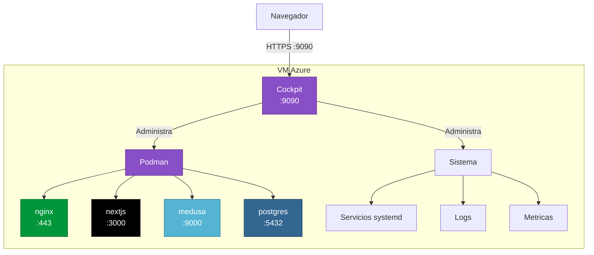

# Cockpit

## Que es

[Cockpit](https://cockpit-project.org/) es una interfaz de administracion web para servidores Linux. Permite gestionar contenedores, servicios, archivos, logs y metricas del sistema desde un navegador, sin necesidad de linea de comandos.

En este proyecto, Cockpit administra la VM de Azure y los contenedores Podman que corren el stack de e-commerce.

---

## Como se instala

El script `terraform/scripts/setup.sh` lo instala automaticamente en la VM:

```bash
apt-get install -y cockpit cockpit-podman
systemctl enable --now cockpit.socket
```

- `cockpit` — interfaz web principal
- `cockpit-podman` — complemento para gestionar contenedores Podman desde Cockpit

---

## Acceso

| Entorno | URL |
|:--------|:----|
| Desde la VM | `https://localhost:9090` |
| Externo | `https://<IP_PUBLICA>:9090` |

**Puerto:** 9090 (TCP) — abierto en el NSG de Azure via Terraform.

> Cockpit usa HTTPS con certificado auto-firmado. El navegador mostrara una advertencia de seguridad. Aceptar para continuar.

---

## Que permite gestionar

### Contenedores (via cockpit-podman)
- Ver contenedores en ejecucion, detenidos o con errores
- Crear, iniciar, detener y eliminar contenedores
- Ver logs en tiempo real
- Inspeccionar variables de entorno, volumes y redes
- Acceder a la terminal de un contenedor

### Sistema
- Metricas de CPU, RAM, disco y red en tiempo real
- Logs del sistema (`journalctl`)
- Servicios systemd (Cockpit, etc.)
- Gestion de usuarios del sistema
- Monitor de red

### Archivos
- Explorador de archivos con editor integrado
- Subir y descargar archivos

---

## Arquitectura en este repo



---

## Configuracion del firewall

Las reglas NSG en `terraform/main.tf` abren el puerto 9090:

```hcl
resource "azurerm_network_security_rule" "cockpit" {
  name                   = "allow-cockpit"
  priority               = 400
  destination_port_range = "9090"
  # ...
}
```

---

## Seguridad

- Cockpit requiere usuario y password del sistema Linux
- En este repo, el usuario es `azureuser` (configurable via `var.admin_username`)
- **Recomendacion para produccion:** restringir el acceso al puerto 9090 a IPs especificas en el NSG en vez de `source_address_prefix = "*"`
