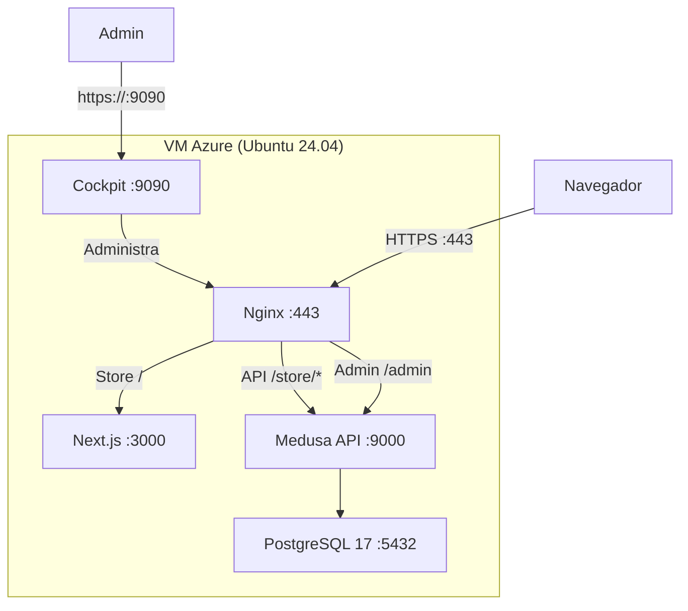

# Despliegue en Azure — Guia paso a paso

Guia completa para desplegar el stack de ecommerce (Next.js + Medusa + PostgreSQL + Nginx) en una VM de Azure con Podman y Cockpit.

---

## Prerrequisitos

- [Terraform](https://www.terraform.io/) >= 1.5
- [Azure CLI](https://docs.microsoft.com/en-us/cli/azure/install-azure-cli) (`az`)
- [Podman Desktop](https://podman-desktop.io/) (incluye Podman + Compose)
- Una cuenta de Azure con suscripcion activa (estudiantil o otherwise)

---

## Paso 1: Autenticar Azure

```powershell
az login
```

Se abre el navegador. Ingresa con tu cuenta de Azure. Una vez autenticado, verifica la suscripcion activa:

```powershell
az account list -o table
```

Si tenes mas de una suscripcion, selecciona la correcta:

```powershell
az account set --subscription "NOMBRE_O_ID_DE_SUSCRIPCION"
```

---

## Paso 2: Crear el archivo de variables de Terraform

Desde la raiz del repo, crea el archivo `terraform/terraform.tfvars`:

```powershell
cd terraform
```

Crea el archivo con este contenido:

```hcl
db_password = "TU_PASSWORD_SEGURA_AQUI"
repo_url    = "https://github.com/Damianpiazz/podman-cockpit-deployment.git"
```

### Variables disponibles

Las siguientes variables ya tienen valores por defecto en `variables.tf`. Solo necesitas definir las que quieras cambiar:

| Variable | Default | Descripcion |
|:---------|:--------|:------------|
| `resource_group_name` | `rg-podman-ecommerce` | Nombre del Resource Group |
| `location` | `East US` | Region de Azure |
| `vm_size` | `Standard_B2s` | Tamano de la VM (la mas barata) |
| `admin_username` | `azureuser` | Usuario admin de la VM |
| `vm_name` | `vm-podman-ecommerce` | Nombre de la VM |
| `environment` | `dev` | Entorno (dev, staging, prod) |
| `db_password` | _(requerido)_ | Password de PostgreSQL |
| `repo_url` | _(requerido)_ | URL del repo Git a clonar en la VM |

Ejemplo con todos los valores personalizados:

```hcl
db_password      = "mi_password_seguro"
repo_url         = "https://github.com/Damianpiazz/podman-cockpit-deployment.git"
resource_group_name = "mi-rg"
location         = "South Central US"
vm_size          = "Standard_B2s"
environment      = "prod"
```

---

## Paso 3: Provisionar la VM con Terraform

```powershell
cd terraform

# Descarga el provider azurerm
terraform init

# Preview de lo que va a crear (lee sin hacer cambios)
terraform plan

# Crea todos los recursos en Azure (~2-3 minutos)
terraform apply
```

Al finalizar, Terraform imprime estos outputs:

| Output | Descripcion |
|:-------|:------------|
| `public_ip_address` | IP publica de la VM |
| `vm_id` | ID de la VM en Azure |
| `ssh_private_key` | Clave SSH privada (generada automaticamente) |
| `cockpit_url` | URL de Cockpit (`https://<IP>:9090`) |
| `site_url` | URL de la tienda (`https://<IP>`) |

### Que crea Terraform en Azure

- Resource Group
- Virtual Network (10.0.0.0/16) + Subnet (10.0.1.0/24)
- IP publica estatica
- Network Security Group (puertos 22, 80, 443, 9090)
- NIC asociada a la VM
- VM Ubuntu 24.04 LTS con cloud-init

---

## Paso 4: Guardar la clave SSH

Terraform genera un par de claves automaticamente. Guardala para poder conectarte:

```powershell
terraform output -raw ssh_private_key > $env:USERPROFILE\.ssh\azure_vm.pem
```

En PowerShell, para proteger el archivo:

```powershell
icacls "$env:USERPROFILE\.ssh\azure_vm.pem" /inheritance:r /grant:r "${env:USERNAME}:R"
```

---

## Paso 5: Conectarse a la VM

Obtener la IP publica:

```powershell
terraform output public_ip_address
```

Conectarse por SSH:

```powershell
ssh azureuser@<IP_PUBLICA> -i $env:USERPROFILE\.ssh\azure_vm.pem
```

### Verificar el cloud-init

El script `setup.sh` se ejecuta automaticamente al crear la VM. Instala Podman, Cockpit, clona el repo, genera secrets, certificados SSL y levanta el stack.

Para monitorear el progreso:

```bash
tail -f /var/log/setup-vm.log
```

Cuando veas `Setup completado`, todo esta listo.

---

## Resultado final

| Servicio | URL | Puerto |
|:---------|:----|:-------|
| **Tienda** | `https://<IP>` | 443 |
| **Medusa Admin** | `https://<IP>/admin` | 443 |
| **Medusa API** | `https://<IP>/store/*` | 443 |
| **Cockpit** | `https://<IP>:9090` | 9090 |

> **Nota:** El certificado SSL es self-signed. El navegador va a mostrar un warning de seguridad. Acepta la excepcion para continuar.

---

## Servicios desplegados en la VM



---

## Solucion de problemas

### Contenedores no inician

```bash
podman compose logs nginx
podman compose logs nextjs
podman compose logs medusa
podman compose logs postgres
```

### Cockpit no carga

```bash
sudo systemctl status cockpit.socket
sudo systemctl start cockpit.socket
```

### Error SSL en el navegador

El certificado es self-signed. Acepta la excepcion de seguridad en el navegador.

### El cloud-init fallo

```bash
cat /var/log/setup-vm.log
```

Si fallo en algun paso, podes re-ejecutar el script manualmente:

```bash
cd /opt/podman-cockpit-deployment
sudo bash ../terraform/scripts/setup.sh
```

---

## Costos estimados

| Recurso | Costo estimado |
|:--------|:---------------|
| VM Standard_B2s | ~$15/mes |
| IP publica estatica | Incluida |
| Storage (30GB SSD) | ~$2/mes |
| **Total** | **~$17/mes** |

> Con creditos estudiantiles de Azure, esto esta cubierto.

---

## Cleanup

Para eliminar todos los recursos de Azure y dejar de generar costos:

```powershell
cd terraform
terraform destroy
```

Esto elimina el Resource Group y todo lo que contiene (VM, red, IP, etc.).
