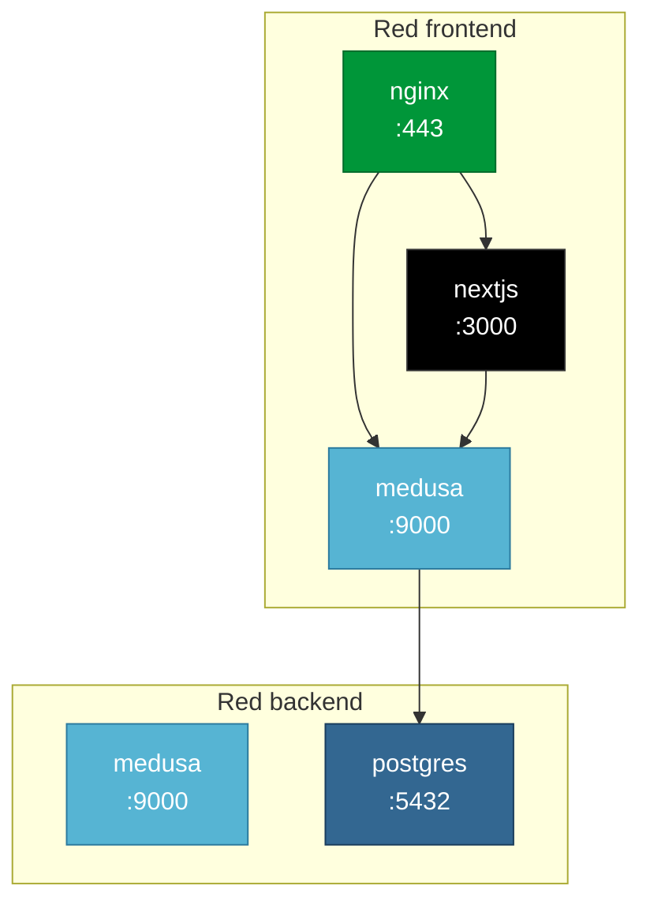

# Podman

## Que es

[Podman](https://podman.io/) es un motor de contenedores open-source, alternativa a Docker. A diferencia de Docker, Podman:

- **No tiene daemon** — cada contenedor es un proceso independiente
- **Rootless** — puede correr sin permisos root
- **Compatble con Docker** — usa las mismas imagenes (OCI) y Compose files

En este proyecto, Podman orquesta los 4 contenedores del stack via `podman compose`.

---

## Diferencias con Docker

| Caracteristica | Docker | Podman |
|:---------------|:-------|:-------|
| Arquitectura | Daemon centralizado (dockerd) | Sin daemon (fork/exec) |
| Permisos | Requiere daemon como root | Rootless por defecto |
| Comando | `docker` | `podman` (mismo CLI) |
| Compose | `docker compose` | `podman compose` (requiere podman-compose) |
| Systemd | Integration limitada | Integracion nativa con systemd |
| Seguridad | Mayor superficie de ataque | Menor superficie de ataque |

---

## Instalacion

### Windows

```bash
winget install RedHat.Podman-Desktop
```

Esto instala:
- Podman CLI
- Podman Desktop (GUI)
- podman-compose (para `podman compose`)

### Linux (Ubuntu)

```bash
sudo apt-get update
sudo apt-get install -y podman podman-compose
```

---

## Archivos clave en este repo

| Archivo | Proposito |
|:--------|:----------|
| `compose.yml` | Define los 4 servicios, redes y volumes |
| `frontend/Dockerfile` | Build multi-stage del frontend Next.js |
| `nginx/Dockerfile` | Build de nginx con config custom |
| `.env.example` | Template de variables de entorno |

---

## compose.yml — Estructura

### Servicios

| Servicio | Imagen/Build | Puerto | Red |
|:---------|:-------------|:-------|:----|
| `nginx` | Build: `nginx/Dockerfile` | 80, 443 (al host) | frontend |
| `nextjs` | Build: `frontend/Dockerfile` | Ninguno (interno) | frontend |
| `medusa` | `medusajs/medusa:latest` | Ninguno (interno) | frontend, backend |
| `postgres` | `postgres:17-alpine` | Ninguno (interno) | backend |

### Redes



- **frontend** — nginx, nextjs y medusa se comunican entre si
- **backend** — solo medusa y postgres se comunican (aislamiento de la BD)

### Volumes

```yaml
volumes:
  pgdata:    # Persiste datos de PostgreSQL entre restarts
```

---

## Dockerfiles

### Frontend (frontend/Dockerfile)

```dockerfile
# Stage 1: Build
FROM node:20-alpine AS builder
RUN corepack enable && corepack prepare yarn@4.12.0 --activate
WORKDIR /app
COPY package.json yarn.lock .yarnrc.yml ./
COPY .yarn .yarn
RUN yarn install --immutable
COPY . .
RUN yarn build

# Stage 2: Run
FROM node:20-alpine AS runner
WORKDIR /app
RUN addgroup --system --gid 1001 nodejs && adduser --system --uid 1001 nextjs
COPY --from=builder /app/.next/standalone ./
COPY --from=builder /app/.next/static ./.next/static
COPY --from=builder /app/public ./public
USER nextjs
EXPOSE 3000
CMD ["node", "server.js"]
```

**Multi-stage build:**
1. **Builder** — instala dependencias y compila Next.js
2. **Runner** — copia solo los archivos necesarios (~100MB vs ~1GB)

### Nginx (nginx/Dockerfile)

```dockerfile
FROM nginx:1.27-alpine
RUN rm /etc/nginx/conf.d/default.conf
COPY nginx.conf /etc/nginx/nginx.conf
COPY conf.d/ /etc/nginx/conf.d/
RUN mkdir -p /etc/nginx/ssl
EXPOSE 80 443
CMD ["nginx", "-g", "daemon off;"]
```

---

## Comandos

### Levantar el stack

```bash
# Build y levantar en background
podman compose up -d --build

# Ver logs en tiempo real
podman compose logs -f

# Ver logs de un servicio especifico
podman compose logs -f medusa
```

### Gestion de contenedores

```bash
# Listar contenedores corriendo
podman ps

# Listar todos los contenedores
podman ps -a

# Detener todo
podman compose down

# Detener y eliminar volumes
podman compose down -v

# Reiniciar un servicio
podman compose restart medusa
```

### Inspeccion

```bash
# Ver variables de entorno de un contenedor
podman exec nextjs-ecommerce env

# Entrar a un contenedor
podman exec -it medusa-ecommerce sh

# Ver uso de recursos
podman stats

# Ver logs de un contenedor
podman logs medusa-ecommerce
```

### Images

```bash
# Listar imagenes
podman images

# Eliminar imagenes sin usar
podman image prune

# Ver tamano de imagenes
podman system df
```

---

## Healthchecks

El servicio PostgreSQL tiene healthcheck configurado:

```yaml
healthcheck:
  test: ["CMD-SHELL", "pg_isready -U medusa -d medusa"]
  interval: 5s
  timeout: 5s
  retries: 5
```

Medusa espera a que PostgreSQL este saludable antes de iniciar:

```yaml
depends_on:
  postgres:
    condition: service_healthy
```

---

## Variables de entorno

Las variables se cargan desde `.env` (raiz del repo) y se inyectan a los contenedores.

```bash
# Copiar template
cp .env.example .env

# Editar con valores reales
# Las variables con ${VAR:-default} usan el default si no estan seteadas
```

**Variables criticas:**

| Variable | Riesgo si no se cambia |
|:---------|:-----------------------|
| `JWT_SECRET` | Tokens JWT predecibles |
| `COOKIE_SECRET` | Cookies manipulables |
| `POSTGRES_PASSWORD` | Acceso no autorizado a la BD |

---

## Troubleshooting

```bash
# "Error: unable to find network"
podman compose up --build    # Reconstruir imagenes

# "Port already in use"
podman ps                    # Ver que usa el puerto
podman stop <container>      # Liberar el puerto

# "database system is starting up"
# PostgreSQL tarda en iniciar, esperar o:
podman compose restart medusa  # Reiniciar medusa despues de postgres

# Ver logs de cloud-init en la VM
ssh azureuser@<IP> "cat /var/log/setup-vm.log"

# Limpiar todo (cuidado: elimina volumes)
podman compose down -v
podman system prune -a
```

---

## Rootless en produccion

Podman rootless tiene limitaciones:
- Puertos < 1021 requieren configuracion especial (`sysctl net.ipv4.ip_unprivileged_port_start=80`)
- En este repo, los puertos 80/443 se exponen desde el host via compose, lo que funciona en rootless con la config adecuada

---

## Referencias

- [Podman Documentation](https://podman.readthedocs.io/)
- [Podman Compose](https://github.com/containers/podman-compose)
- [Podman vs Docker](https://podman.io/blogs/2019/02/13/podman-vs-docker.html)
- [OCI Specifications](https://opencontainers.org/)
